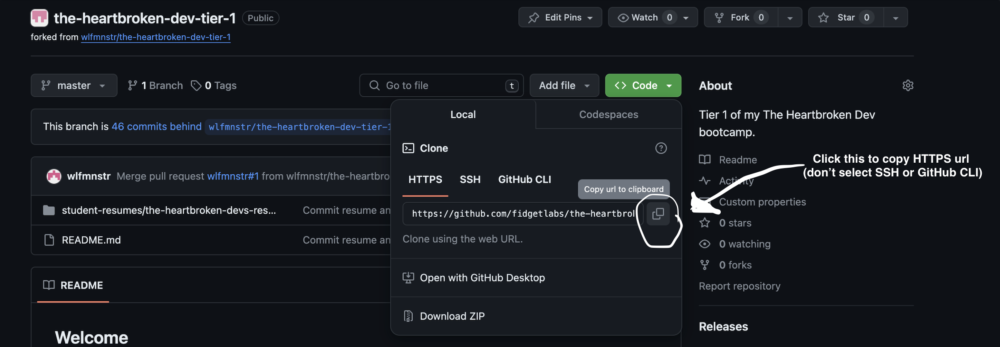
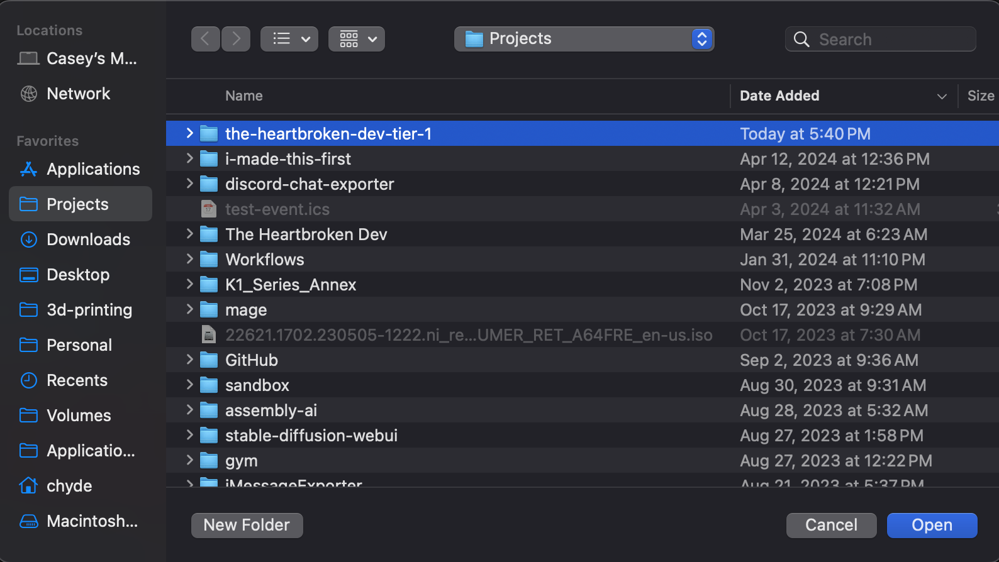
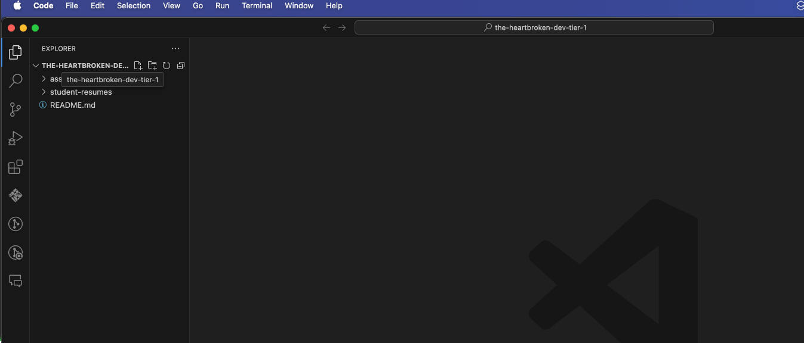
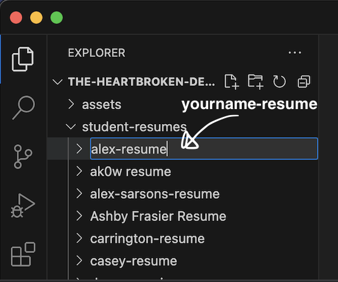
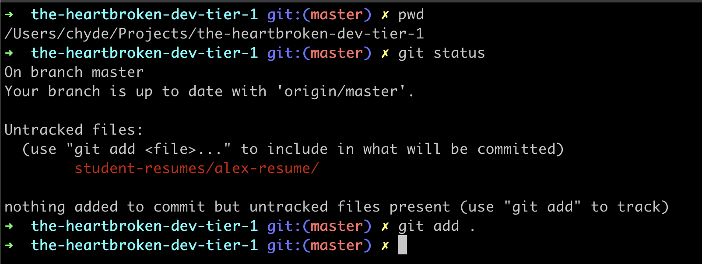
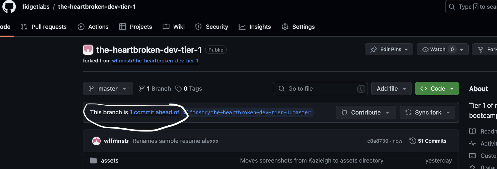

## Welcome

Welcome Students to the Tier 1 of The Heartbroken Dev’s full-stack software engineering curriculum!!

This is the first of several instructor led tiers which are specifically designed to give students the ability to build and deploy full stack software applications from scratch in 2024 and beyond.

If you’re here, you’ve already completed pre-work. That pre-work, for many of you was your very first taste of writing anything that even remotely resembled computer code. I cannot begin to describe just how awesome this is…

Whether you are starting from zero or have a decade of experience under your belt, the fact that you are here right now in tier 1 represents a willingness to be vulnerable and learn something new. It represents a willingness to take a chance on yourself.

Things that you should be EXCEPTIONALLY proud of yourself for doing…

Things I’m exceptionally proud of you for doing…

Tl;dr - I love you all, and it means the world to me that you’re here. Okay, on to the code…

## What you’ll Learn

**In this tier we will focus on these 3 things:**

1. Setting up your machine to successfully write full-stack javascript code and complete the curriculum.
2. Setting up some accounts in free services we will be using to deploy software throughout the course.
3. Getting a primer on the Javascript programming language and writing your first working javascript code.

## 1. Getting You Computer Setup for Javascript Development

>[!TIP] Do ALL of the steps in this section
>You may have done some of the steps to setup your machine and accounts which are detailed below during your pre-work assignments or in life before The Heartbroken Dev’s Bootcamp.
>
>However, each student should read through and understand each of these steps to ensure their machine is setup the way this curriculum is expecting.
>
>Future you thanks you for doing these things :)

### 1. GitHub Setup

1. **Create and/or Login to your GitHub Account:**
	1. If you do not have a github account, head to: https://github.com/signup and create an account. Choose a username you wouldn’t mind a future employer or colleagues seeing.
	2. If you already have a github account, login and return to this page once you’re logged in.

### 2. Terminal Setup

*Mac Instructions:* Your machine should come with an application called “Terminal” - just confirm you have this app installed and can open it.

1. Use Spotlight (cmd + space) to search for “terminal"
2. Open the app.
3. Come talk to me if you can’t find the app.

*Windows Instructions:*

#### Native Command Prompt (Shell)

Your system comes with a program called “Command Prompt.”

1. To access it, click on the Start menu or press the Windows key.
2. Type `cmd` into the search bar and press Enter.
3. The Command Prompt should appear in the search results. Click on it to open.
	1. Alternatively, you can also find it by navigating to Start > All Programs > Accessories > Command Prompt.
4. If you have trouble finding or opening Command Prompt, it’s possible to download and install Windows Terminal from the Microsoft Store for a more modern experience.
	1. Go to the Microsoft Store app on your PC and search for “Windows Terminal.”
	2. Select the app from the search results and click on the “Get” button to download and install it.
5. Once you have either Command Prompt or Windows Terminal open, you're ready to proceed with the necessary commands or operations.
6. If you encounter any issues opening Command Prompt or Windows Terminal, please reach out for assistance.

#### Windows Subsystem for Linux

Alternatively you can install the windows subsystem for linux to be able to run a shell and have an environment more similar to mac.

1. Enable the WSL by going into the control pannel / settings and then select Apps (or it might be named Programs).

2. Select "Programs and Features"

3. Enable the

4. Scroll down and enable the Windows Subsystem for Linux

5. This will ask you to reboot, say yes.
6. After you reboot, run a admin powershell by typing it in the search bar next to the start menu and right clicking it from the list "Run as administrator"
7. This opens up a PowerShell. Type `wsl --install -D Ubuntu`. This will download the distro and prompt you for a username and password to use in your WSL environment.
8. Type `wsl` from a PowerShell to run the default shell.
9. Git will already be installed. You can install node with `sudo apt install nodejs`

### 3. Install Git

First, some quick vocab for y’all:

- **VCS:** “Version Control System” - A VCS is a tool to help keep track of versions of things, typically versions of code.
	- As an example, you might use a VCS tool to help you save an original copy of the HTML file you created for your resume in the pre-work assignment then use it to help you manage updates to your resume file as you modify that file over time.
	- VCS tools commonly provide a way to “commit” new changes, “clone” existing codebases, create variations of code and keep them separate in “branches”, and all sorts of other fun things we’ll learn about when we dig in to Git a bit later.
- **Git:** is an open source VCS. Think of it like a program that runs on your computer that you can use in your coding projects to help manage versions of that project.
	- Managing versions of code becomes especially important the more iterations the code goes through, the more complex/large the codebase becomes, and the more people you have working on it.
	- Git is the most common VCS for code today, by a large margin.
	- We will have a section in a-bit digging in and understanding Git.
	- Git is NOT GitHub.
        - Git Bash is the name for the command-line terminal environment
	- Read about git here: https://git-scm.com/
- **SCM:** “Source Code Manager” - A SCM is a tool to help *manage* source code. In particular, to help manage the sharing and using and collaboration on source code.
	- GitHub is an example of an SCM (and the most popular in use by software engineers today).
- **GitHub:** GitHub.com is a for profit company, owned by Microsoft, who provides Source Code Management services for its customers (amongst other services now too).
	- GitHub store Git Repositories for us in a centralized place (the “cloud”).
	- It enables multiple people to collaborate on the same codebase and help make the processes of merging different peoples changes into the codebase more seamless and error free.

**Okay, now we’ll install Git - the Version Control System - on our computers…**

1. Head to https://git-scm.com/
2. Click on “Downloads”

1. Download the version for your Operating System (Windows, Mac, Linux).
	1. Click the Download icon for your OS under the “Download” banner.
		1. DON’T download the GUI shown lower on the page.
	2. This will download an installer, when finished, open and run the installer, following its instructions and using the default settings.

Let me know if you have problems installing Git.

### 4. Install Node.js

First, some more vocab for you!

- **JavaScript:** - A programming language that runs in web browsers (and elsewhere in 2024). It sounds like Java, but its a totally different programming language. It was invented back in the Netscape Navigator days and has seen a ton of changes and innovations over the last few decades. Fans of the language might refer to it as “The language of the web.” Like other programming languages, its purpose is to allow people to write in human-readable ways instructions for computers to follow. The interactivity and dynamic features of modern web pages use javascript to code that interactivity.
- **Client:** - A term used to describe the other half of the “client-server” model of computer networks.
	- Clients make requests and receive responses from Servers.
	- Web Clients typically fetch HTML, CSS, and Javascript files the web servers.
		- Your web browser (Chrome, Safari, Firefox, Etc.) is an example of a type of client you would call a “Web Client”.
	- Email Clients are another example of a Client.
		- The “Mail” app on an iphone is an example of an Email Client, it sends and receives data to and from Email Servers like Gmail, Yahoo Mail, and others.
	- A client could be just the “front-end” of the client-server model, your laptop might be drawn as the “client” on some diagrams.
	- A client can also be more specific, like the example of applications running on your computer/smartphone/etc like mail, chrome, etc…
- **Server:** - A term used to describe the “back end” of the client-server networking model. Its just like any other computer, because any computer can be a server, and all servers are computers. Servers serve assets to typically many clients, its their main job to handle often LOTS of requests from LOTS of clients at the same time.
- **Web Browser** - An application which fetches web pages from web servers, traditionally in the form of html, css, and javascript files.
	- Web browsers then handle the rendering of these html, css, and Javascript files (because looking at `<h1>Hello World<h1>` would get pretty old, pretty fast for most of us.
	- Google Chrome is a web browser. So is firefox, mobile safari, etc.
	- Web browsers act as the client-side and front-end of the client-server model of the web.
- **Web Server:** - A term used to describe the “back end” of the client-server networking model typically used on the web. Web servers are just computers like all other computers. They run applications that handle receiving requests (often lots of them simultaneously) and sending out the appropriate responses (files or data).
	- Examples of common web server applications are: nginx, Apache HTTP Server, several others you’ve probably never heard of, and the one we are going to work with in this course: Node.js
	- Think of a web server as a computer, running an application that a web client can talk to.
	- When you host a website (like your resume if you completed the challenge mode), you are saving your html file on a web server.
	- When you visit a website, your browser, acting as the client, makes a request to the web server hosting the HTML, CSS, and Javascript files for that website - saying: “hey, show me the www.google.com files please”. The server responds with those files and they are then rendered on your screen (if all goes according to plan anyway).
- **JavaScript Engine:** - Your web browser needs a way to execute the javascript files it receives. Javascript Engines are what they use to do this. It goes something like this:
	- JavaScript code - something that’s fairly human readable - ends up in your browser and first needs to be turned into instructions the browser and computer can understand (0’s and 1’s). This is called compilation - turning human readable code into machine readable instructions.
		- There’s a notion of line-by-line compilation (rather than whole-file compilation) that’s called “interpretation”.
		- We call Javascript and “interpreted” language.
			- Technically, modern Javascript engines use a process called “Just-in-time” compilation, or JIT, but we’re way in the weeds and you don’t need to know any of this right now.
		- A popular (the most popular probably) Javascript engine is the Google V8 Javascript Engine. Its what runs in chrome and lots of other browsers and handles the interpretation/compilation of javascript into code your browser can then execute. It then also executes that code.
	- JavaScript NEEDS a Javascript Engine to run. For the first decade+ of Javascript’s lifetime, this meant it could only run in browsers with a working Javascript Engine.
	- Then came Node.js in 2009…
- **Node.js:** Node.js (or just “Node”) is a cross-platform (it can run on windows, mac, linux, and others) “JavaScript Runtime Environment”. It uses the Google V8 engine to run Javascript outside of the browser. Tl;dr - “back-end” applications like web servers can now be written in JavaScript.
	- Although not technically the first way to run javascript outside of the browser, it was the first that also ran well at web-scale and could handle lots of requests simultaneously.
	- Here’s the wiki: https://en.wikipedia.org/wiki/Node.js

Tl;dr - Node.js is how we run javascript on the “back-end” and what we will be using to build full stack apps in this curriculum. It lets us learn one programming language that we can use across the stack.

Okay, now on to the install. This part is actually pretty easy.

1. Head to https://nodejs.org/en/download and download the LTS version for your operating system and hardware. It SHOULD be auto selected for your correct computer, but double check before downloading.
2. Open the installer that is downloaded and follow the steps to install node.
3. That’s it! Let me know if you get stuck!

### 5. Installing a Code Editor (VSCode)

Hopefully everyone completed this as part of pre-work, but I will post some basic instructions here regardless. If folks need a more in-depth guide or walkthrough of setting up and using VSCode and cannot find answers in the existing content on The Heartbroken Dev discord or from the community there, let me know.

Do these things if you didn’t install VS Code yet, as this is the editor I’ll assume you’re using for the remainder of this course.

1. Head to https://code.visualstudio.com/
2. Click the download button (it should be set for you os and processor type, but double check to make sure you download the right one).
3. Then follow the instructions for installing the editor on your given operating system found under setup on this page: https://code.visualstudio.com/docs/setup/setup-overview

By all means, play around with VSCode and get familiar with it! Its an awesome piece of software that is almost infinitely extensible with its massive library of installable extensions, and it comes pretty great out of the box.

### 6. Fork This Repository

Okay now we’re getting fancy and learning how to use this SCM stuff that we talked about earlier with GitHub.

We are going to “Fork” **this** repository. Some of you may know what this means, and others it may be totally foreign. That’s great!

- Forking is how you can clone / copy a repository that is outside of your GitHub account, into your github account.
- This will give you a "forked" copy of the repository that is now effectively totally your own repository.
- You can make any changes you want to your fork without impacting the repository you forked from (my repository in this case).
- The repository you forked from is called the "upstream" repository.
- Forks keep track of the upstream as well, so as the original repository changes, or your repository changes, you will see on your repo how much "ahead" or "behind" the upstream repo your forked repo is. (this is cool if you are trying to make changes that you eventually want to request be incorporated into the upstream repo - a process we'll cover in just a bit!)

**Here's how to do this:**
1. assuming you are logged in to github as detailed in the earlier steps,from the main page of my repository for this tier-1 content (where you're probably reading this right now, but the url is [https://github.com/wlfmnstr/the-heartbroken-dev-tier-1](https://github.com/wlfmnstr/the-heartbroken-dev-tier-1)) click the "fork" button. Here's a screenshot:

2. Follow the prompts to fork it to YOUR github account. Another screenshot: 
3. When you click "create fork" it will redirect to your account, it sometimes takes a second to complete this step. You should have something that looks like this: 

### 7. Add Your Resume to Your Fork Using Git Commands and PR back to My Repo

***IMPORTANT NOTE ABOUT SCREENSHOTS***
The screenshots are for example purposes only, dont rely on them totally, as the urls, repositories, etc. won’t match up perfectly with what you should see when running git commands and cloning/pushing to and from your personal forks of my repository! Follow the written instructions and understand that the screenshots might show things like pushing to `wlfmnstr/the-heartbroken-dev-tier-1` when your screen will look more like `your-username/the-heartbroken-dev-tier-1`. 

tl;dr - trust the instructions as the source of truth and use the screenshots as helpful examples.

…

Okay, now, we're going to practice collaborating on a github repository!

The flow will look something like this:

1. Fork the repo to you personal GitHub account
2. Clone your forked repo to your local machine
3. Add a directory and resume files to your local copy of the repo
4. Commit the changes (the new files and directory you added) to your local repo
5. Pushes those changes from your local repo to the remote repo (your fork still)
6. Create Pull Request from your fork to my original repo, which is the “upstream” repo in this context.

Here’s a diagram (if this is helpful, great! If its just more confusion, don’t sweat it, you don’t need to understand the diagram right now).

#### Clone Your Fork

1. After you’ve forked the “upstream” repository and have navigated to **your** forked repo on GitHub, copy the git url from the repository page. Screenshot: 
2. In your command prompt, navigate to the location you want to clone your repository to in your file system, then run the command `git clone` followed by the url you copied. In my case that looks like this: 
(To navigate to the location you want to clone your repository - use the 'cd' command followed by the path to the folder you choose - this can be copied from your file explorer). 

   This will pull down the repo to your computer, creating a directory wherever you run the command, named whatever the repository you are cloning is named. In this case, the directory it created was called `the-heartbroken-dev-tier-1`.

3. List the contents of the directory you’re in 'dir' to confirm the clone operation was successful: 
   (I also used the `|` pipe and `grep` commands in my example to filter the results of running the list contents command `ls` to just results the contained `the-heart`. If you’re interested, you can read about pipe and grep in linux here: https://faculty.winthrop.edu/dannellys/csci208lab/lab09.htm)

#### Open the Repository You Cloned

Now that you’ve got a local copy of the repo, let’s open it up in our code editor of choice, VS Code.

1. Open VS Code and click `file` > `open folder` (might look a little different on windows): 
2. Then select the directory you just created when you cloned the repo and click “open”: 
3. You should have the repository open in VS Code now: 

#### Create a Directory for Your Resume and Add Your Files to it

Now we want to add some of your code to this repository. We’ll use the html and css files your created for the pre-work assignments here. Follow these steps:

1. Create a directory inside of `student-resumes` using the naming convention: `<yourname>-resume`. You can do this by right clicking on the `student-resumes` directory in the *File Explorer* tab of VSCode, like so:
	1. Go to File Explorer 
	2. Create the new directory (vs code calls it a folder): 
	3. Name it following the described naming convention: 
	4. Add your resume files - you can do this from the command line if you know how, or you can drag & drop like I did: 

#### Commit and Push Your Changes

Ok, now we’ve made changes to our local repository, and we should “push” these changes to our remote repository so they aren’t just on our computer.

1. From your command prompt, navigate to this repository’s directory using 'cd', and add the new files and changes to the git “staging area.” Do this with the `git add` command. Some notes:
	1. You can see what the state of your repository is, including changed files and what has been added to the staging area by running `git status`: 
	2. `git add` needs an additional argument passed to it: the specific files you want to add. You can specify the files specifically, one at a time, or multiple other ways. (git add doesn't need you to add the folder only the specific files) 
	3. A nice shortcut if you want to add everything that’s been updated to the staging area is the `.` specifier, which says “the things in my current *working directory*” (working directory just means the directory you’ve currently navigated to in your command prompt).
	4. So, the end result is (assuming you’ve navigated to your repository folder): `git add .` 
	5. Run `git status` again and see that the files have been staged and are ready to be “committed”: 
2. Now we want to actually commit these staged changes. Having the staging area is nice because sometimes you made LOTS of changes and only want to commit some of them and it helps to sort everything out. Like laying your camping items out on the floor before putting them into your backpack or car. Simply run the “commit” command to create a commit of your staged changes. The command is `git commit` but we want to include a “commit message” too!
	1. Do this by also passing the `-m` command “flag” to the git commit command, followed by your commit message in quotes like: `"My commit message"`.
	2. The end result should look like: `git commit -m "Adds Caseys Resume directory and files"`.
	3. You can run git status afterwards to see the new state of the repository: 
3. Now we want to “push” or local repository which contains the new commit we just made to our remote repository in github. Do this with the `git push` command. You shouldn’t need anything else, though it may require you to login/authenticate…
	1. [Here’s a link](https://docs.github.com/en/authentication/keeping-your-account-and-data-secure/managing-your-personal-access-tokens#using-a-personal-access-token-on-the-command-line) on how to use personal access tokens on the command line in case you weren’t already prompted to login when cloning the repository in previous steps.
	2. A personal access token is like  a password you can use with your username to login to github.
	3. All of this might be irrelevant if you’ve already successfully logged in, and I haven’t really worked through writing this part out for students, so come see me or check in the discord chat for your cohort to see how students resolved issue if they ran into them around logging into github on the command line!

	 Assuming you’re logged in correctly and attempting to push to the correct repo, you should get a success message when running `git push` (yours will look a little different for you, but you should get a success message after pushing to YOUR fork): 

#### Create a Pull Request from your fork to my Upstream repo

Okay, lastly we are going to request to pull your changes you made on your copy of the repo into my original “upstream” repo. Do this from the GitHub website.
1. Navigate to your forked version of the repository. It should state that there are changes and it is ahead of the upstream repo by some commits, click on the “_ commit ahead of” link: 
2. This will take you to a page that is the start of creating a pull request, click the “Create pull request” button: 
3. Type in some helpful additional details on the pull request, like what changes are included, etc. and then click “create pull request” one again! 
4. You should now see the created pull request page, which will be in a state of “waiting for review” which just means you can’t merge it yet, but the owners of the repository you are request to pull your changes into have been notified and can review your changes and merge the PR when they are ready!

#### PHEW!

Alright, you’ve done it! That was probably a lot of stuff for a lot of you, but you’ve successfully navigated the command line, wrapped your head around git and github and even used it to make what’s possibly your first ever PRs in your career…. HELL YEAH!
